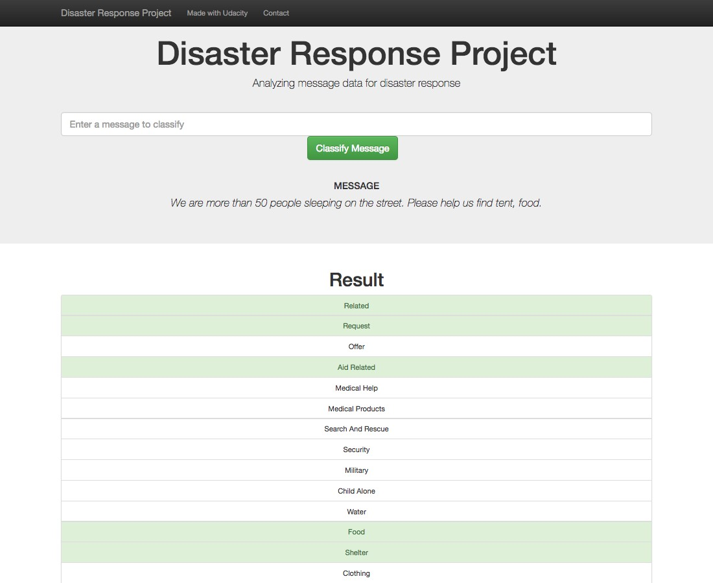
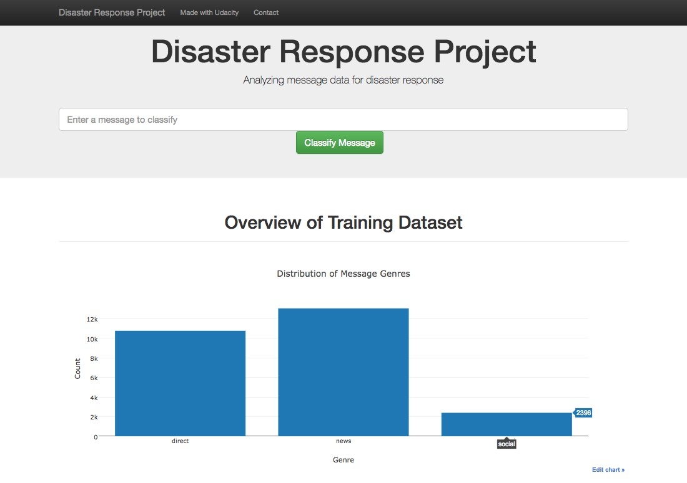

# Disaster Response Pipeline Project

## 1. Installation
I use python 3.5 to create this project and the main libraries I used are:
- sikit-learn ==0.19.1
- nltk == 3.2.5
- Flask==1.0.2
- gunicorn==19.9.0
- numpy==1.15.0
- pandas==0.23.4
- plotly==3.3.0
- sqlalchemy==1.2.12

## 2. Project Motivation

Project code is deployed a program as a web application in the internet. The web application Programming is a project in Udacity Data Scientist Nanodegree program. In this project, I analyze disaster data from Figure Eight to build a model for an API that classifies disaster messages. I find a data set containing real messages that were sent during disaster events.

I create a machine learning pipeline to categorize these events so that I can send the messages to an appropriate disaster relief agency. I split the data into a training set and a test set. Then,I create a machine learning pipeline that uses NLTK, as well as scikit-learn's Pipeline and GridSearchCV to output a final model. Finally, I export the model to a pickle file.

The project also include a web app where an emergency worker can input a new message and get classification results in several categories.

The web app also displays visualizations of the data as follows:

## 3. File Descriptions
- \
	- README.md
	- ETL Pipeline Preparation.ipynb
	- ML Pipeline Preparation.ipynb
- \app
	- run.py
	- templates
	- \app\templates
	- go.html
	- master.html
- \data
	- DisasterResponse.db
	- disaster_categories.csv
	- disaster_messages.csv
	- process_data.py
- \models
	- classifier.pkl
	- train_classifier.py

## 4.Instructions:

     1. Run the following commands in the project's root directory to set up your database and model.

         - To run ETL pipeline that cleans data and stores in database
             `python data/process_data.py data/disaster_messages.csv data/disaster_categories.csv data/DisasterResponse.db`
         - To run ML pipeline that trains classifier and saves
             `python models/train_classifier.py data/DisasterResponse.db models/classifier.pkl`

     2. Run the following command in the app's directory to run your web app.
         `python run.py`

     3. Go to http://0.0.0.0:3001/

## 5. Summary

The program is deployed in the heroku website . It can be visited as the following links:
 - https://nettravel-disasterapp.herokuapp.com/

## 6. Licensing, Author, Acknowledgements
This work is licensed under a [Creative Commons  Attribution-NonCommercial-NoDerivatives 4.0 International License](http://creativecommons.org/licenses/by-nc-nd/4.0/). Please refer to [Udacity Terms of Service](https://www.udacity.com/legal) for further information.
